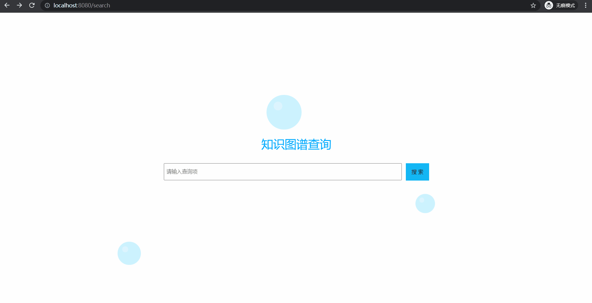

### KGShow (Knowledge Graph Show)

本项目是一个知识图谱可视化程序，采用前后端分离技术实现，前端使用 Vue，后端使用 Flask

<br/>

### 前端部署

前端项目在 `client` 目录下，首先切换到此目录

```shell
cd client
```

安装依赖

```shell
npm install
```

启动项目，项目运行地址为 <127.0.0.1:8080>

```shell
npm run serve
```

<br/>

### 后端部署

后端项目在 `server` 目录下，首先切换到此目录

```shell
cd server
```

安装依赖

```shell
pip install -r requirements.txt
```

爬取数据

> 爬取的数据将会放在 `data` 目录下，分别保存为 `entities.csv` 和 `relation.csv`
>
> 项目中已提供爬取好的数据，你也可以运行以下命令重新爬取

```shell
python util/crawl.py
```

启动项目，项目运行地址为 <127.0.0.1:5000>

```shell
python index.py
```

<br/>

### 效果展示

